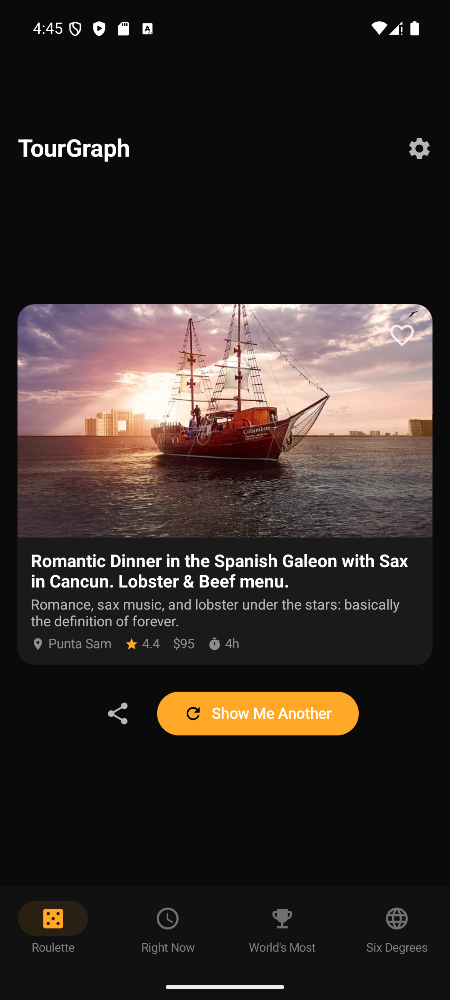
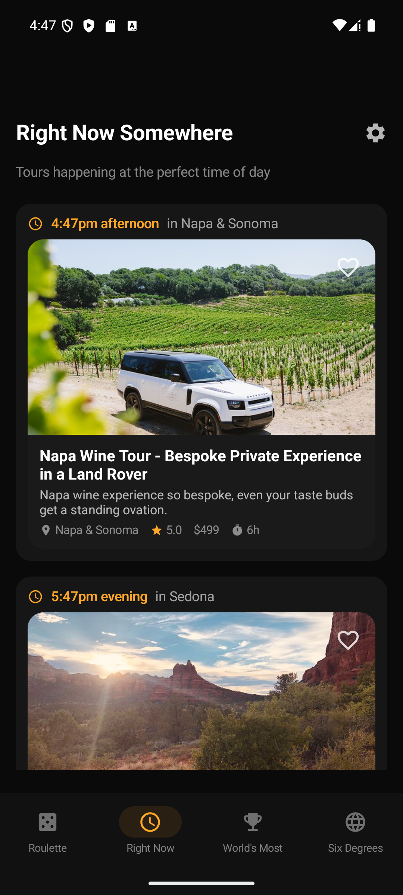
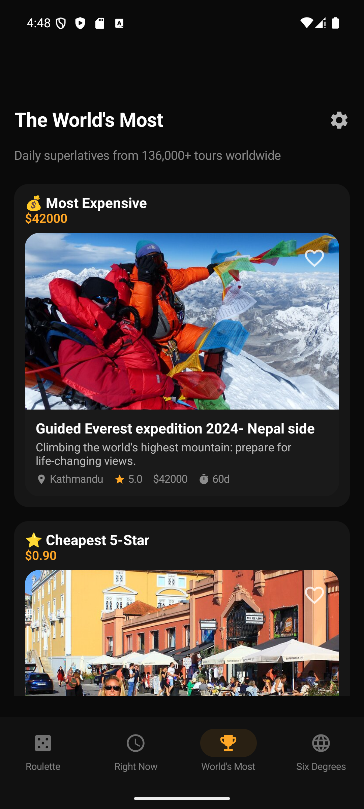
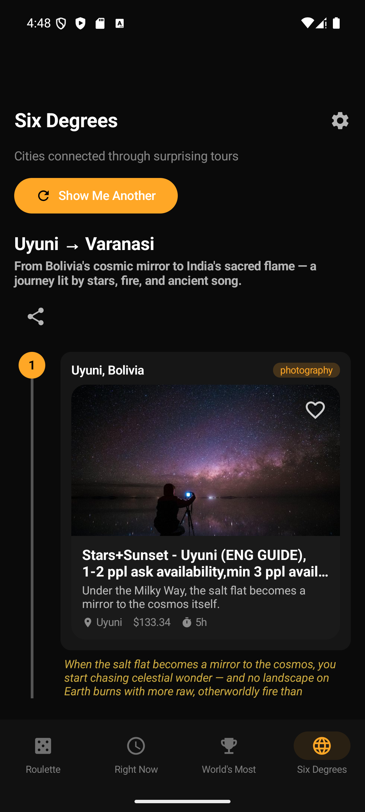
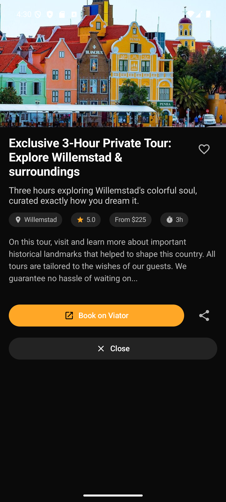

# TourGraph — The World's Tour Data, Made Delightful

A zero-friction site and mobile app that makes people smile using the world's tour data. 136,000+ tours across 2,700+ destinations, AI-generated witty captions, and four ways to discover something surprising.

**Live at [tourgraph.ai](https://tourgraph.ai)**

## Why

Every travel app wants you to plan, compare, and book. TourGraph wants you to smile. No accounts, no algorithms, no itineraries — just the world's most surprising tours, served up one random spin at a time. The kind of thing you pull up when you're bored in line and 20 minutes later you're still scrolling.

## Download

### iOS

- **App Store**: [v1.1 submitted](https://apps.apple.com/app/id6759991920), pending review

### Android

- **Direct APK**: Download from [GitHub Releases](https://github.com/nikhilsi/tourgraph/releases) — install directly on any Android 8.0+ device
- **F-Droid**: Submitted ([MR #34392](https://gitlab.com/fdroid/fdroiddata/-/merge_requests/34392)), pending review

### Web

- **[tourgraph.ai](https://tourgraph.ai)** — works on any device with a browser

## Features

### Core

- **Tour Roulette** — One button. Random tour. Weighted toward the extremes: highest rated, weirdest, cheapest, most expensive. AI-generated witty one-liner. Swipe or press again.
- **Right Now Somewhere...** — Time-zone-aware. Shows tours happening right now where it's golden hour. "Right now in Kyoto it's 6:47am and you could be doing forest bathing with a Buddhist monk."
- **The World's Most ___** — Superlatives from 136,000+ experiences. Most expensive tour. Cheapest 5-star. Longest duration. Each one a shareable card with photo, stat, and witty caption.
- **Six Degrees of Anywhere** — 491 pre-generated chains connecting cities through surprising thematic links. Chain roulette with vertical timeline. "Surprise Me" to load another.

### Native

- **Favorites** — Save tours with a heart tap, persist across sessions
- **Home Screen Widgets** — Right Now Somewhere and Random Tour on your home screen (iOS [WidgetKit](https://developer.apple.com/widgets/) + Android [Glance](https://developer.android.com/develop/ui/compose/glance))
- **Rich Share Cards** — Beautiful 1200×630 branded image cards when sharing tours
- **App Shortcuts** — Quick actions from long-press (Android) and [Siri Shortcuts](https://developer.apple.com/siri/) (iOS)
- **Search Indexing** — Favorited tours searchable from [Spotlight](https://developer.apple.com/documentation/corespotlight) (iOS) and launcher (Android)
- **Deep Linking** — `tourgraph://` URL scheme for tab navigation and tour detail

## Screenshots

| Tour Roulette | Right Now | World's Most | Six Degrees | Tour Detail |
|:---:|:---:|:---:|:---:|:---:|
|  |  |  |  |  |

## Tech Stack

| Component | Technology |
|-----------|-----------|
| Web | [Next.js](https://nextjs.org/) 16 (App Router, TypeScript strict), [Tailwind CSS](https://tailwindcss.com/) v4 |
| iOS | Swift / [SwiftUI](https://developer.apple.com/xcode/swiftui/) (iOS 17+), [GRDB.swift](https://github.com/groue/GRDB.swift), [WidgetKit](https://developer.apple.com/widgets/) |
| Android | [Kotlin](https://kotlinlang.org/) 2.1 / [Jetpack Compose](https://developer.android.com/develop/ui/compose) (Material 3), [Glance](https://developer.android.com/develop/ui/compose/glance), [Coil](https://coil-kt.github.io/coil/) 3 |
| Database | SQLite everywhere — [better-sqlite3](https://github.com/WiseLibs/better-sqlite3) (web), [GRDB](https://github.com/groue/GRDB.swift) (iOS), raw SQLiteDatabase (Android) |
| Hosting | [DigitalOcean](https://www.digitalocean.com/) ($6/mo droplet), [PM2](https://pm2.keymetrics.io/) + [Nginx](https://nginx.org/) + [Let's Encrypt](https://letsencrypt.org/) |
| Data | [Viator Partner API](https://www.viator.com/partners) (136,000+ experiences, 2,700+ destinations) |
| AI | [Claude API](https://docs.anthropic.com/) — Haiku 4.5 (captions), Sonnet 4.6 (city intelligence + chains) |
| CI/CD | [GitHub Actions](https://github.com/features/actions) — automated Android release on tag push |
| Domain | [tourgraph.ai](https://tourgraph.ai) |

## Data Asset (4 Layers)

TourGraph's value is built in layers, each adding original intelligence on top of raw tour data:

| Layer | What | Count |
|-------|------|-------|
| 1. Raw Viator Data | Tour listings, photos, ratings, prices | 136,256 tours |
| 2. AI One-Liners | Witty personality captions per tour | 136,256 (100%) |
| 3. City Intelligence | City profiles: personality, standout tours, themes | 910 cities |
| 4. Chain Connections | Thematic chains connecting cities | 491 chains |

479 MB database, 2,712 destinations, 205 countries, 7 continents.

## Project Structure

```text
tourgraph/
├── .github/workflows/       # CI/CD (Android release on tag push)
├── src/                     # Next.js web app
│   ├── app/                 # Pages + API routes
│   ├── components/          # React components
│   ├── lib/                 # Database, types, formatting
│   └── scripts/             # Data pipeline (4 stages)
│       ├── 1-viator/        # Viator API indexing
│       ├── 2-oneliners/     # AI caption generation
│       ├── 3-city-intel/    # City intelligence pipeline
│       └── 4-chains/        # Six Degrees chain generation
├── ios/TourGraph/           # SwiftUI iOS app
├── android/TourGraph/       # Kotlin + Jetpack Compose Android app
├── fastlane/                # F-Droid metadata + screenshots
├── docs/                    # Architecture, design, data docs
├── data/                    # SQLite databases (Git LFS)
└── archive/                 # Phase 0 work (preserved for reference)
```

## Getting Started

### Web App

```bash
node --version              # 18+ required
npm install
cp .env.example .env.local  # Add VIATOR_API_KEY + ANTHROPIC_API_KEY
npm run dev                 # http://localhost:3000
```

### iOS App

Open `ios/TourGraph/TourGraph.xcodeproj` in Xcode and run on simulator or device (iOS 17+).

### Android App

Open `android/TourGraph/` in Android Studio and run on emulator or device (API 26+).

```bash
# Build debug APK
cd android/TourGraph && ./gradlew assembleDebug

# Build signed release APK
cd android/TourGraph && ./gradlew assembleRelease
```

### Data Pipeline

```bash
# Full rebuild from scratch (see src/scripts/README.md for details)
npx tsx src/scripts/1-viator/seed-destinations.ts
npx tsx src/scripts/1-viator/indexer.ts
npx tsx src/scripts/2-oneliners/backfill-oneliners-batch.ts
npx tsx src/scripts/3-city-intel/build-city-profiles.ts
npx tsx src/scripts/4-chains/generate-chains-v2.ts
```

## Roadmap

- Weekly data refresh (drip indexer on schedule) + delta sync to mobile apps
- On-demand chain generation (user types two cities)
- iPad layout
- City discovery pages
- Theme browsing (filter by cuisine, sacred, adventure, etc.)

## Background

TourGraph started as AI-powered supply-side infrastructure for the tours & experiences industry. After competitive validation revealed that Peek, TourRadar, Magpie, and Expedia had all shipped live MCP servers, the original thesis was killed and the project pivoted to this consumer experience. The Phase 0 extraction work (83 products, 7 operators, 95% accuracy) is preserved in `archive/` for reference.

Full story: [docs/reference/thesis_validation.md](docs/reference/thesis_validation.md)

## Data Source

All tour data sourced from the [Viator Partner API](https://www.viator.com/partners) (Basic tier, free affiliate program). TourGraph is a Viator affiliate — booking links redirect to Viator. AI-generated one-liners, city intelligence, and chain connections are original content created with the [Claude API](https://docs.anthropic.com/).

## License

MIT License. See [LICENSE](LICENSE) for details.
